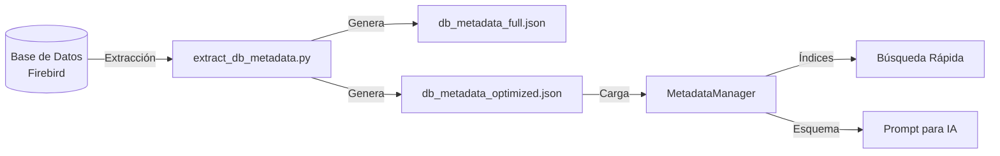

# 🚀 DEVIA - Sistema Genérico de Gestión & Inteligencia Artificial

**Documento Técnico de Referencia**

Prompt de desarrollo: "Actúa como un experto en desarrollo software, e inteligencia artificial. quiero crear diferentes aplicaciones entorno a una base de datos para que a partir de un modelo de inteligencia artifical, poder hacerle preguntas al modelo sobre los datos de la base de datos. además, realizar diferentes pantallas de la aplicación web, para gestionar la información de la base de datos, sacar estadísticas etc. además, quiero que los usuarios de la aplicación, puedan configurar sencillamente sus prompts, con diferentes tipos de abstracción, y dificultad, teniendo en cuenta que habrá usuarios con muchos conocimientos y otros sin ninguno. quiero que crear toda la estructura genérica para diferentes bases de datos y tipos de estructuras. además, que se sigan todos los patrones de diseño, y principios de desarrollo software, de calidad, robustez, usabilidad, abstracción, seguridad, orientación a objetos, multihilo, escalabilidad, refactorización, etc.... ficheros de 500 líneas como mucho, ficheros de constantes, de parámetros, todo ultra organizado en carpetas, ficheros descriptivos, eficiente, eficaz, etc quiero que este proyecto tenga su propio archivo DEVIA.MD esquemático eficiente y super útil. utiliza el fichero DEVIA_GESTION_ARTICULOS.md para hacerte una idea de cómo hacerlo, ya que en concreto, aunque deba ser genérico, ha de funcionar para la conexión a la base de datos que describe."

---

## 📋 ÍNDICE RÁPIDO

1. [Arquitectura del Sistema](#arquitectura)
2. [Estructura de Archivos](#estructura)
3. [Patrones de Diseño](#patrones)
4. [Guías de Desarrollo](#guias)
5. [Configuración](#configuracion)
6. [Extensibilidad](#extensibilidad)

---

## 🏗️ ARQUITECTURA DEL SISTEMA {#arquitectura}

El sistema sigue una arquitectura en capas estricta para garantizar desacoplamiento y escalabilidad.

```mermaid
graph TD
    Client[Cliente Web (SPA)] --> API[API Gateway (FastAPI)]
    API --> Core[Núcleo del Sistema]
    
    subgraph "Núcleo (Core)"
        Auth[Gestor de Autenticación]
        PromptMgr[Gestor de Prompts]
        AIMgr[Gestor de IA]
        DBMgr[Gestor de Base de Datos]
    end
    
    subgraph "Capa de Abstracción (Drivers)"
        AIDriver[Drivers IA]
        DBDriver[Drivers BD]
    end
    
    AIMgr --> AIDriver
    DBMgr --> DBDriver
    
    AIDriver --> Gemini[Google Gemini]
    AIDriver --> OpenAI[OpenAI GPT]
    AIDriver --> Groq[Groq Llama]
    
    DBDriver --> Firebird[Firebird SQL]
    DBDriver --> Postgres[PostgreSQL]
    DBDriver --> MySQL[MySQL]
```

---

## 📁 ESTRUCTURA DE ARCHIVOS {#estructura}

Todo el código debe estar ultra-organizado. Máximo 500 líneas por fichero.

```
/
├── backend/
│   ├── core/                          # Lógica central del sistema
│   │   ├── abstract/                  # Clases base abstractas (Interfaces)
│   │   │   ├── ai.py                  # Interface para proveedores de IA
│   │   │   └── database.py            # Interface para drivers de BD
│   │   ├── config/                    # ⚙️ CONFIGURACIÓN CENTRALIZADA
│   │   │   ├── settings.py            # Variables de entorno (.env)
│   │   │   ├── ai_models_config.json  # 🤖 Modelos IA disponibles
│   │   │   ├── db_metadata_optimized.json  # 📊 METADATOS BD REALES
│   │   │   ├── database_metadata.py   # Wrapper de metadatos (usa JSON)
│   │   │   ├── metadata_manager.py    # Gestor de metadatos semánticos
│   │   │   └── model_manager.py       # Gestor de modelos IA
│   │   ├── factory/                   # Fábricas de objetos
│   │   │   ├── ai_factory.py          # Factory para proveedores IA
│   │   │   └── db_factory.py          # Factory para drivers BD
│   │   └── utils/                     # Utilidades generales
│   │       └── constants.py           # 🔧 CONSTANTES DEL SISTEMA
│   ├── drivers/                       # Implementaciones específicas
│   │   ├── ai/                        # Drivers de IA
│   │   │   ├── gemini_driver.py       # Google Gemini
│   │   │   ├── groq_driver.py         # Groq (Llama)
│   │   │   └── openai_compatible_driver.py  # OpenAI/OpenRouter
│   │   └── db/                        # Drivers de BD
│   │       ├── firebird_driver.py     # Firebird SQL
│   │       └── firebird_queries.py    # Queries específicas Firebird
│   ├── modules/                       # Módulos de negocio
│   │   ├── chat/                      # 💬 CHAT CON IA (Text-to-SQL)
│   │   │   ├── router.py              # Endpoints FastAPI
│   │   │   └── service.py             # 🧠 Lógica de chat y SQL
│   │   ├── models/                    # Gestión de modelos IA
│   │   │   └── router.py              # CRUD de modelos
│   │   └── prompts/                   # Gestión de prompts
│   │       └── router.py              # CRUD de prompts
│   ├── scripts/                       # 🛠️ Scripts de utilidad
│   │   ├── extract_db_metadata.py     # Extracción automática de esquema
│   │   └── diagnose_schema.py         # Diagnóstico de conexión BD
│   └── main.py                        # 🚀 Punto de entrada API
│
├── frontend/
│   ├── assets/
│   │   ├── css/                       # Estilos modulares
│   │   │   ├── base.css               # Estilos base
│   │   │   └── components.css         # Componentes UI
│   │   └── js/                        # Lógica de cliente
│   │       ├── core/                  # Framework ligero propio
│   │       │   ├── api.js             # Cliente HTTP
│   │       │   ├── constants.js       # Constantes frontend
│   │       │   └── router.js          # Enrutador SPA
│   │       └── modules/               # Lógica por pantalla
│   │           ├── chat.js            # 💬 Interfaz de chat
│   │           └── models.js          # Gestión de modelos
│   └── index.html                     # SPA Entry Point
│
├── .env                               # 🔐 SECRETOS (API Keys, DB creds)
├── .env.example                       # Plantilla de .env
├── .gitignore                         # Archivos ignorados por Git
├── DEVIA.MD                           # 📖 Este archivo
├── README.md                          # Documentación general
└── start_system.bat                   # Script de inicio (Windows)
```

### 📌 Archivos Clave para Modificar

| Archivo | Propósito | Cuándo Modificar |
|---------|-----------|------------------|
| `backend/core/config/db_metadata_optimized.json` | **Esquema de BD real** | Al cambiar tablas/columnas en la BD |
| `backend/core/config/ai_models_config.json` | Modelos IA disponibles | Al añadir/quitar modelos IA |
| `backend/core/utils/constants.py` | Constantes del sistema | Al añadir nuevas constantes |
| `backend/modules/chat/service.py` | Lógica Text-to-SQL | Al cambiar prompts o lógica de chat |
| `.env` | API Keys y credenciales | Al cambiar claves o BD |


---

## 🧩 PATRONES DE DISEÑO {#patrones}

Se aplican estrictamente los siguientes patrones para asegurar robustez:

1.  **Factory Method**: Para la creación de conexiones a BD y proveedores de IA.
    *   `DBFactory.get_connection("firebird")`
    *   `AIFactory.get_provider("gemini")`
2.  **Strategy**: Para intercambiar algoritmos de procesamiento o proveedores en tiempo de ejecución.
3.  **Singleton**: Para gestores de configuración y pools de conexiones.
4.  **Repository**: Para abstraer el acceso a datos de la lógica de negocio.
5.  **Dependency Injection**: Inyección de dependencias en los servicios para facilitar testing.

---

## 📏 GUÍAS DE DESARROLLO {#guias}

> [!IMPORTANT]
> **Reglas de Oro**
> 1.  **Max 500 líneas**: Si un archivo pasa de 500 líneas, se refactoriza y divide.
> 2.  **Documentación**: Todo método público debe tener DocString.
> 3.  **Tipado**: Uso estricto de Type Hints en Python.
> 4.  **Constantes**: No usar "números mágicos" ni strings sueltos. Todo a ficheros de constantes.

### Estándar de Código (Python)
```python
class DatabaseDriver(ABC):
    """Clase base para drivers de base de datos."""
    
    @abstractmethod
    def connect(self, config: DBConfig) -> Connection:
        """Establece conexión con la base de datos."""
        pass
```

---

## ⚙️ CONFIGURACIÓN {#configuracion}

El sistema es altamente configurable mediante archivos JSON y variables de entorno.

### `ai_config.json`
```json
{
  "default_provider": "gemini",
  "providers": {
    "gemini": {
      "api_key": "ENV_GEMINI_KEY",
      "model": "gemini-1.5-pro"
    }
  }
}
```

### `prompts_config.json`
Permite definir niveles de complejidad para los usuarios.
```json
{
  "levels": {
    "beginner": {
      "abstraction": "high",
      "ui_mode": "wizard"
    },
    "expert": {
      "abstraction": "none",
      "ui_mode": "raw_json"
    }
  }
}
```

---

## 🗄️ SISTEMA DE METADATOS DE BASE DE DATOS {#metadatos}

El sistema incluye un gestor inteligente de metadatos que optimiza las consultas a la IA.

### Arquitectura de Metadatos



### Componentes del Sistema

#### 1. **Extractor de Metadatos** (`backend/scripts/extract_db_metadata.py`)
Script que se ejecuta una vez para extraer toda la información de la BD:
- Tablas y columnas con tipos de datos
- Primary Keys y Foreign Keys
- Conteo de registros por tabla
- Clasificación automática por categorías

**Uso:**
```bash
python backend/scripts/extract_db_metadata.py
```

**Salida:**
- `db_metadata_full.json`: Metadatos completos (para referencia)
- `db_metadata_optimized.json`: Versión ligera para IA (solo esencial)

#### 2. **Gestor de Metadatos** (`backend/core/config/metadata_manager.py`)
Clase que gestiona los metadatos en memoria con búsqueda optimizada:

```python
from backend.core.config.metadata_manager import get_metadata_manager

manager = get_metadata_manager()

# Buscar tablas por concepto
tables = manager.find_tables_by_concept("productos")  # → ['ARTICULO']

# Generar esquema enfocado según pregunta
schema = manager.get_focused_schema("cuántos productos hay?")

# Obtener estadísticas
stats = manager.get_statistics()
```

#### 3. **Metadatos Semánticos** (`backend/core/config/database_metadata.py`)
Mapeo manual de conceptos de negocio a tablas reales:

```python
DATABASE_METADATA = {
    "ARTICULO": {
        "descripcion": "Productos/artículos del inventario",
        "conceptos": ["productos", "artículos", "items"],
        "columnas_clave": {
            "CODIGO": "Código único",
            "NOMBRE": "Nombre del producto",
            "PVPIVA": "Precio con IVA"
        }
    }
}
```

### Optimización para IA

El sistema envía a la IA **solo la información relevante**:

1. **Detección de contexto**: Analiza la pregunta del usuario
2. **Filtrado inteligente**: Solo incluye tablas relacionadas
3. **Límite de columnas**: Máximo 15 columnas por tabla
4. **Priorización**: Tablas con más registros primero

**Ejemplo:**
- Pregunta: "cuántos productos hay?"
- Esquema enviado: Solo tabla ARTICULO (no todas las 436 tablas)
- Tokens ahorrados: ~90%

### Categorías de Tablas

El sistema clasifica automáticamente las tablas:
- `productos`: ARTICULO, PRODUCTO, ITEM
- `clientes`: CLIENTE, CUSTOMER
- `ventas`: FACTURA, INVOICE, VENTA
- `proveedores`: PROVEEDOR, SUPPLIER
- `compras`: PEDIDO, ORDER, COMPRA
- `inventario`: STOCK, ALMACEN
- `usuarios`: USUARIO, USER, EMPLEADO
- `configuracion`: CONFIG, PARAM, SETTING
- `otros`: Resto de tablas

### Actualización de Metadatos

Para actualizar los metadatos cuando cambia la estructura de la BD:

```bash
# 1. Re-ejecutar extractor
python backend/scripts/extract_db_metadata.py

# 2. El sistema recarga automáticamente en el siguiente reinicio
```

> [!TIP]
> **Rendimiento**: Los metadatos se cargan una vez al inicio y se mantienen en memoria.
> No hay consultas a la BD en cada pregunta del usuario.

---

## 🚀 EXTENSIBILIDAD {#extensibilidad}

### Añadir una nueva Base de Datos
1.  Crear `backend/drivers/db/new_db_driver.py`.
2.  Heredar de `DatabaseDriver`.
3.  Implementar métodos requeridos.
4.  Registrar en `DBFactory`.

### Añadir un nuevo Módulo
1.  Crear carpeta en `backend/modules/nuevo_modulo`.
2.  Definir rutas en `router.py`.
3.  Implementar servicios y repositorios.
4.  Añadir UI en `frontend/assets/js/modules/nuevo_modulo.js`.

---

## 🛠️ ESTADO ACTUAL DEL PROYECTO (Noviembre 2025)

### ✅ Funcionalidades Implementadas
1.  **Backend Unificado**: Servidor FastAPI (`backend/main.py`) sirviendo API y Frontend estático.
2.  **Gestión de Modelos IA**:
    *   Soporte para **OpenAI, Google Gemini, Groq, OpenRouter**.
    *   Configuración dinámica vía UI y `.env`.
    *   Sistema de "Drivers" para estandarizar la comunicación con diferentes proveedores.
3.  **Chat con Base de Datos (Text-to-SQL)**:
    *   Conversión de lenguaje natural a SQL (Firebird 2.5).
    *   **Sistema de Metadatos Semánticos**: `database_metadata.py` mapea conceptos de negocio (e.g., "ventas") a tablas reales (`CAB_FACT_VENTA`).
    *   **Prompt Engineering Avanzado**: Instrucciones estrictas para evitar alucinaciones y forzar formato JSON/SQL.
4.  **Seguridad**:
    *   Gestión de secretos vía `.env` (API Keys, credenciales BD).
    *   Sanitización de logs (truncado de claves).

### 🚧 En Progreso / Pendiente
1.  **Validación de Esquema BD**:
    *   Ajuste fino de nombres de tablas/columnas (`CAB_FACT_VENTA`, `PVP`) basado en feedback de errores reales.
    *   Script de extracción automática de metadatos (`extract_db_metadata.py`) pendiente de depuración de conexión.
2.  **Mejoras de UI**:
    *   Visualización de tablas de datos más rica en el chat.
    *   Historial de conversaciones persistente.

### 📝 Notas de Configuración
*   **Base de Datos**: Firebird 2.5.
*   **Conexión**: Se usa `firebirdsql` (driver puro Python).
*   **Metadatos**: Definidos manualmente en `backend/core/config/database_metadata.py` para garantizar precisión semántica.

---

## 🔄 FLUJO DE CHAT (Text-to-SQL)

1.  **Usuario**: Envía pregunta (e.g., "¿Productos más caros?").
2.  **ChatService**:
    *   Carga configuración del modelo seleccionado.
    *   Recupera el **Esquema Semántico** (`get_semantic_schema()`).
    *   Construye el **System Prompt** con instrucciones estrictas y el esquema.
3.  **IA**: Genera consulta SQL (e.g., `SELECT FIRST 10 ...`).
4.  **ChatService**:
    *   Detecta bloque ` ```sql `.
    *   Ejecuta la consulta contra Firebird.
    *   Recibe resultados (lista de diccionarios).
5.  **ChatService**:
    *   Construye un segundo prompt con la pregunta original + SQL ejecutado + Resultados.
    *   Solicita a la IA una **Interpretación** en lenguaje natural (con reglas estrictas: Euros, Objetividad).
6.  **Usuario**: Recibe la respuesta interpretada.
